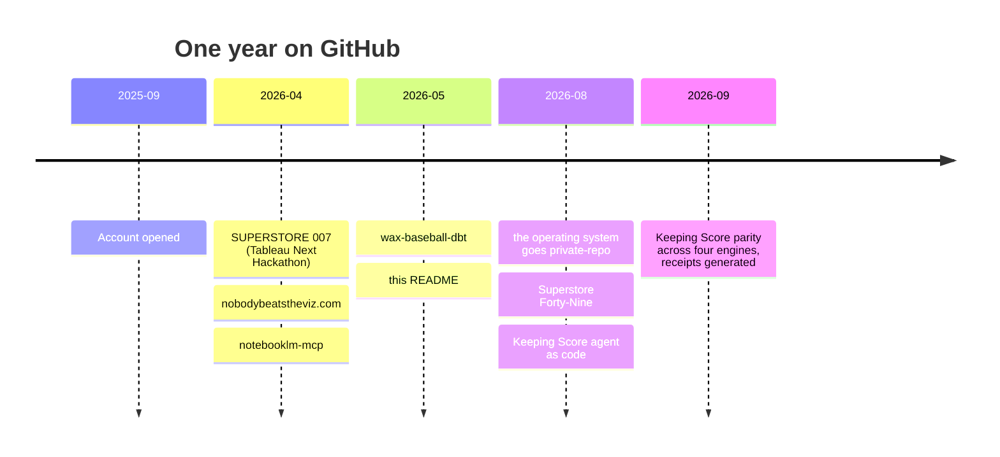

# Hi, I'm Wax 👋

**Agentic Analytics Architect** — [Nobody Beats the Viz](https://nobodybeatstheviz.com/). *Same questions. New tools.*

Seventeen years in Tableau: analyst → developer → architect → consultant, most recently Principal BI Architect at CodaMetrix. Healthcare analytics is the deep domain. Now building where the stack is going — semantic layers, MCP, Agentforce, agents that act instead of dashboards that wait.

## Git, in a year

A year ago this account didn't exist.

| | |
|---|---|
| Account opened | 2025-09-18 |
| First repo | 2026-04-15, a hackathon build |
| Today | 12 repos · 253 commits · the whole operating system in one of them |

Seventeen years of shipping analytics and I never had a Source layer for my own work. Workbooks in a shared drive. SQL in a warehouse. A folder of `final_v3`. Every data-modeling book says the same three things — source is never mutated, analysis derives, presentation is disposable — and I held that line for clients for two decades while my own files fused all three.

Git fixed that, but not the way I expected. It isn't a backup. It's an append-only log of every state the work has ever been in, with a dated, human-written note on each entry saying *why*. That makes it the warehouse for history: already complete, already immutable, free until something asks it a question.

So the rule I run now is short. **The document carries what is true today. The commit message carries how it got that way.** No doc keeps its own changelog; `git log -p -- path/` is the archaeology, on demand.

The biggest repo here is private: my job search, my builds, my practices, run as a codebase through Claude Code. It moved from a Drive folder to a repo in August 2026, and the arithmetic moved with it — one logical change used to cost eight file edits across hand-kept indexes; now the indexes are generated. The lesson underneath is the one I'd give any client adopting AI right now: **the agent's job is to write the generator, not to be the generator.**

## Building

- ⚾ **Keeping Score** — 178 MLB games I was actually in the stands for, 1984–2025, from a hand-kept scorecard tradition to a governed semantic layer with agents on top. dbt on BigQuery, the same seven metrics answered on Snowflake, Databricks, and Salesforce Data 360, verified by one parity harness. [`wax-baseball-dbt`](https://github.com/nobodybeatstheviz/wax-baseball-dbt) · [`wax-baseball-agentforce`](https://github.com/nobodybeatstheviz/wax-baseball-agentforce), an Agentforce agent written as code that declines instead of guessing · [the bit](https://nobodybeatstheviz.com/bits/wax-baseball/)
- 🔁 **Superstore Forty-Nine** — a cross-silo Agentforce agent on a Data 360 foundation: identity resolution, leading-vs-lagging signal ranking, and a human hand-off via review Case. [`ss49-agentforce`](https://github.com/nobodybeatstheviz/ss49-agentforce) · [the bit](https://nobodybeatstheviz.com/bits/superstore-49/)
- 🕶️ **SUPERSTORE 007** — Tableau Next Hackathon 2026. The most-used demo dataset in analytics, pushed past the dashboard: question on the viz, action in Slack, no tabs in between. [`superstore-007`](https://github.com/nobodybeatstheviz/superstore-007) · [the bit](https://nobodybeatstheviz.com/bits/superstore-007/)
- 🔌 [`notebooklm-mcp`](https://github.com/nobodybeatstheviz/notebooklm-mcp) — an MCP server for NotebookLM.
- 🌐 [`nobodybeatstheviz.github.io`](https://github.com/nobodybeatstheviz/nobodybeatstheviz.github.io) — the site. Static HTML, no build step, deployed from `main`.

## How the work gets made

Everything here is built with Claude Code as a collaborator, and the mechanism is meant to be visible. I direct, the model executes — Sol LeWitt energy applied to building. It reads the ambiguous input and proposes; I rule. Anything that repeats or accumulates state becomes a script the model wrote once, not a judgment it re-makes every session. Commits credit the collaboration. If a README here reads like it was written by two hands, it was.

Bricolage over polish: ship the build, document the work, the patina is the point. "Here, I made this."

Credentials, for the record: Certified Tableau Consultant · Salesforce Double Star Ranger · Agentblazer Innovator '26 · five Agentforce Superbadges · co-founder, Albany NY Tableau User Group.

## Find me

- 🌐 [nobodybeatstheviz.com](https://nobodybeatstheviz.com/)
- 💼 [LinkedIn](https://www.linkedin.com/in/georgeweatherwax)
- 🧭 [Trailblazer](https://www.salesforce.com/trailblazer/georgeweatherwax)
- 📊 [Tableau Public](https://public.tableau.com/app/profile/wax2368)
- 📧 george.weatherwax@gmail.com

---

*The tools keep changing. The question never does.*
